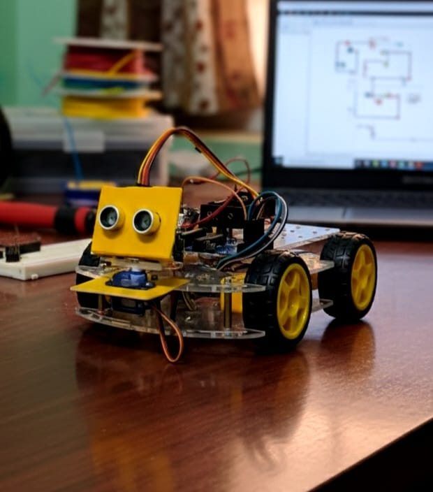

# Obstacle Avoiding Robot using Arduino

An autonomous obstacle-avoiding robot built using **Arduino UNO**, **HC-SR04 ultrasonic sensor**, **servo motor**, and **L298N motor driver**.  
The robot detects obstacles in real time, scans left and right using a servo-mounted ultrasonic sensor, and intelligently chooses the safest path.

---

##  Features

- Real-time obstacle detection using ultrasonic sensing  
- Servo-based left–right scanning mechanism  
- Autonomous navigation without manual control  
- Differential drive using DC motors  
- Simple and efficient Arduino-based logic  

---

##  Hardware Components

- Arduino UNO  
- HC-SR04 Ultrasonic Sensor  
- Servo Motor (SG90)  
- L298N Dual H-Bridge Motor Driver  
- DC Motors 
- Battery   
- Jumper Wires  

---

## 🔌 Pin Configuration

### Ultrasonic Sensor
| Signal | Arduino Pin |
|------|-------------|
| TRIG | D11 |
| ECHO | D12 |

### Servo Motor
| Signal | Arduino Pin |
|------|-------------|
| Control | D3 |

### L298N Motor Driver
| Function | Arduino Pin |
|--------|-------------|
| ENA (Right Motor PWM) | D5 |
| IN1 | D7 |
| IN2 | D8 |
| ENB (Left Motor PWM) | D6 |
| IN3 | D9 |
| IN4 | D10 |

---

##  Project Images

### RoboCar Image

### Circuit Diagram

>  *Make sure the image files are uploaded to the repository with the same names.*

---

##  Working Principle

1. The ultrasonic sensor measures the distance in front of the robot.
2. If an obstacle is detected within **30 cm**:
   - The robot stops and reverses briefly.
   - The servo rotates the sensor to the left and right.
   - Distances on both sides are measured.
3. The robot turns toward the side with more free space.
4. If no obstacle is detected, the robot moves forward.

---

##  Software & Libraries

- **Arduino IDE**
- **Servo.h** – for servo motor control  
- **NewPing.h** – for efficient ultrasonic sensor operation  

Install `NewPing` from Arduino Library Manager.

---

##  Algorithm

1. Initialize motors, servo, and ultrasonic sensor  
2. Move forward continuously  
3. Detect obstacle  
4. Stop → Reverse → Scan left and right  
5. Compare distances  
6. Turn toward safer direction  
7. Resume forward motion  

---

##  Applications

- Autonomous robots  
- Embedded systems learning  
- Robotics mini-projects  
- Academic and research demonstrations  

---

##  Future Improvements

- PID-based motor control  
- IR sensors for edge detection  
- Bluetooth/Wi-Fi remote control  
- Camera-based obstacle detection  
- ROS integration  

---

